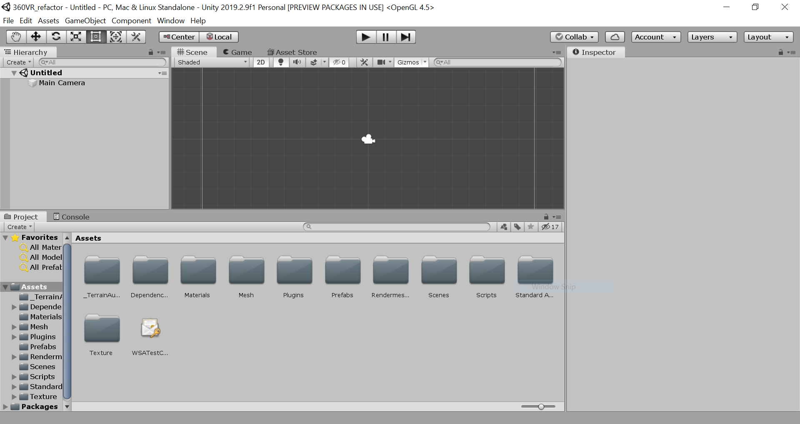
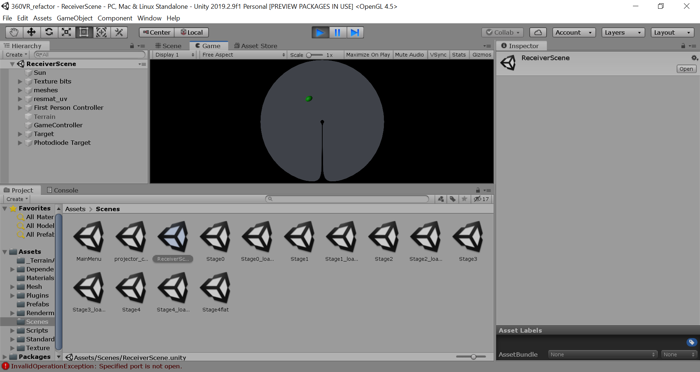

===============
Getting Started
===============

Pulling the Repository
########################

To begin with, fork/clone the master git repository, found at https://github.com/AndreasHogstrand/VR_pyControl . This is an open repository and should be freely accessible to clone: permission to push changes to the repository can be requested from an admin (HogstrandAndreas@gmail.com). Code is contained within 2 folders in the master directory: 360VR_refactor for Unity and Arduino scripts, and pyControl for Python scripts.

Setting up a PyControl environment
########################################
NOTE: Instructions on setting up PyControl are available in greater detail at the PyControl documentation: https://pycontrol.readthedocs.io/en/latest/

To begin using PyControl, a python environment should be established to run PyControl scripts. At the time of writing, the latest version of Python compatible with PyControl is 3.7.5. As this is not the latest version of Python, you may wish to create a seperate Python environment to run Pycontrol: this can be achieved by setting up a Python Virtual Environment (https://docs.python.org/3/tutorial/venv.html). Note that while Anaconda could also be used, at the time of development there was an incompatibiltiy with pyControl due to conda and pip using different package names.

Installing dependencies
*****************************
PyControl's dependencies may be installed using the following commands:

.. code-block:: none

	python -m pip install numpy
	python -m pip install pyserial
	python -m pip install pyqt5
	python -m pip install pyqtgraph

To test the environment has installed correctly, navigate to the GUI folder within the Pycontrol directory and run the gui using

.. code-block:: none

	python pyControl_GUI.py

If the command executes and opens the pyControl GUI, the installation has been successful.

Testing PyControl
*********************
To test the environment and board, connect the Pycontrol board to the computer via the mico-USB at the head of the board. Run the PyControl GUI, select the COM port from the drop down menu, and click connect. Once connected, load framework scripts onto the board using "Config, Load framework". Providing no errors are contained within framework scripts, the GUI terminal should return "Transfering pyControl framework to pyboard... OK".

To test the board, select "Blinker" from the task drop down, Upload, then Start. This should cause the blue LED on the Pyboard to blink, while returning state information to the GUI.

The VR_pycontrol task may also be tested by selecting "VGO_task" from the task dropdown; this task will run even without Unity, but all trials will register as fails (Figure 2).

*Figure 2: Running VGO_task disconnected from Unity*

Setting up Unity
############################
The Unity Hub can be downloaded wuth a personal license at https://store.unity.com/download?ref=personal. Completing installation and setup should allow the Unity Editor to be opened; this may be tested with an example project. 

To set up the Unity portion of this project, use the Add button on the Projects tab of Unity Hub and navigate to the folder /YourDirectory/VR_pyControl/360VR_refactor/. The project currently runs on Unity 2019.2.9f1 but may be upgraded by selecting a more recent patch under "Unity Version" in the hub.

Launching the project should present a screen similar to Figure 3: 

*Figure 3: Unity upon first launch*

Testing Unity Receiver
*************************
Before connecting the Pycontrol board, the Unity portion of the project should be tested with no additional hardware plugged in:

To test the Unity portion of this project (also referred to as the Unity receiver), navigate to the scene "ReceiverScene". In the Project window (Figure 3, bottom window), select "Scenes" and then "ReceiverScene". This should load the correct scene for receiver operation (Figure 4).

.. image:: images/ReceiverScene.png
   :width: 800

*Figure 4: Unity loaded into the Receiver scene*

To test the project is running correctly press the play arrow (Figure 3, top centre). The green fixation pointer should appear, and should be movable in debug mode with the arrow keys.

*Figure 5: Unity loaded into the Receiver scene*