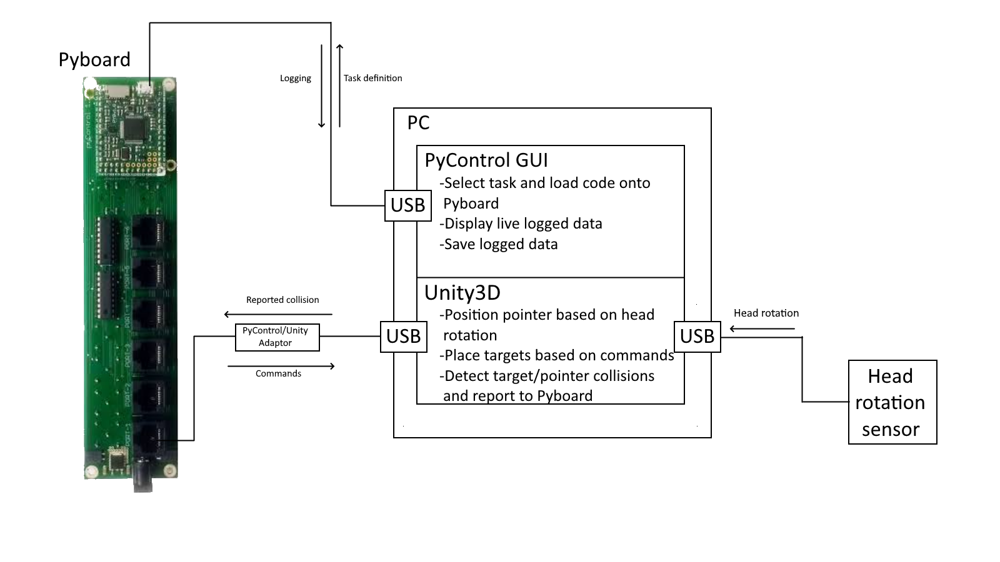

========
Overview
========

VR_pycontrol is an integration of the Unity based Tripodi lab VR with open source pyControl experiment control and recording. Unity is used for 3D visualisation and geometry, while pyControl is used for high precision timing of experimental events. The pyControl portion of this project is python based, while the Unity portion of this project is scripted in C#.

PyControl
##############

PyControl is a system of open source hardware and software for controlling behavioural experiments, built around the Micropython microcontroller. PyControl is used as the framework to run experiments in the VR_pycontrol project. Functionality and usage is well explained by its own `documentation <https://pycontrol.readthedocs.io/en/latest/>`_.

Unity
############

Unity is used for 3D visualisation and geometry (collision detection). Unity is treated as a hardware device by PyControl, and communicated with over the behaviour ports' UART serial (`hardware devices in pyControl <https://pycontrol.readthedocs.io/en/latest/user-guide/hardware/>`_). The main functionality of Unity is to place and render the targets and pointer, and detect collisions between the two.

Overview
############

*Figure: Overview of VR_pycontrol system showing all components*

The purpose of this system is to provide a framework for experiments investigating the head movements of mice in response to visual targets. These experiments typically take the form of generating targets within the animal's field of vision, and giving a reward if the mouse fixates upon the target.

The specifics of task design are specified in micropython using a task definition file, which is then loaded onto the Pyboard. The Pyboard runs this experiment, determining when and where targets should be generated. When a target is required, a command is sent to Unity to create the target. Unity tracks the mouse's fixation point with a cursor, and upon collision between target and cursor returns a message to the PyBoard. The PyBoard checks for either a succesful trial or a failed (timeout) trial, and then proceeds with the experiment accordingly. Logging and control of other hardware devices, such as a photodiode to determine the timestamp of target appearance/disappearance, is also controlled by the Pyboard.

Further work on this project should immediately be directed towards logging head sensor data on the Pyboard, as this data is important and should be recorded alongside other timestamps.

:doc:`Getting Started >> <Getting Started>`